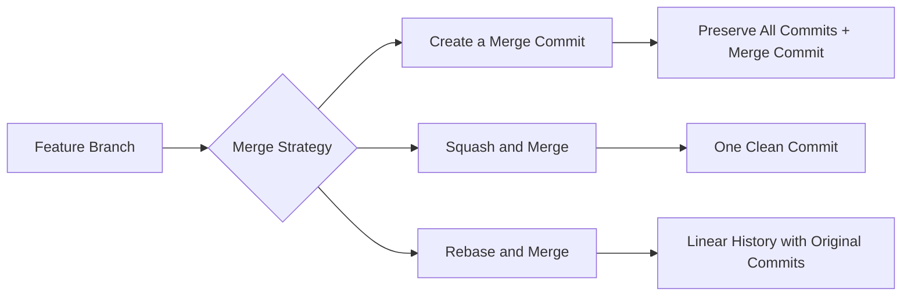
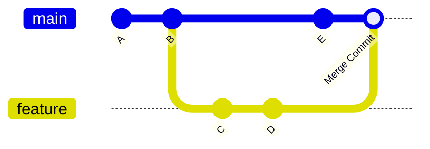
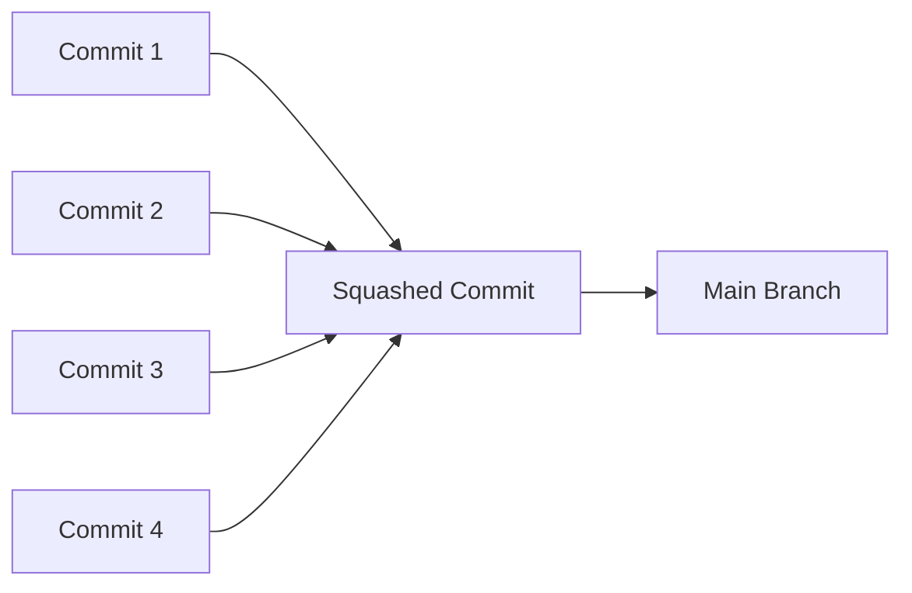
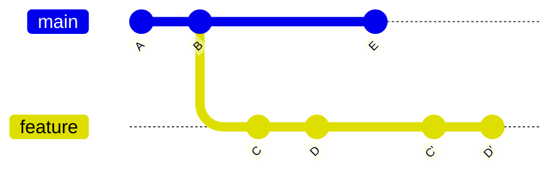
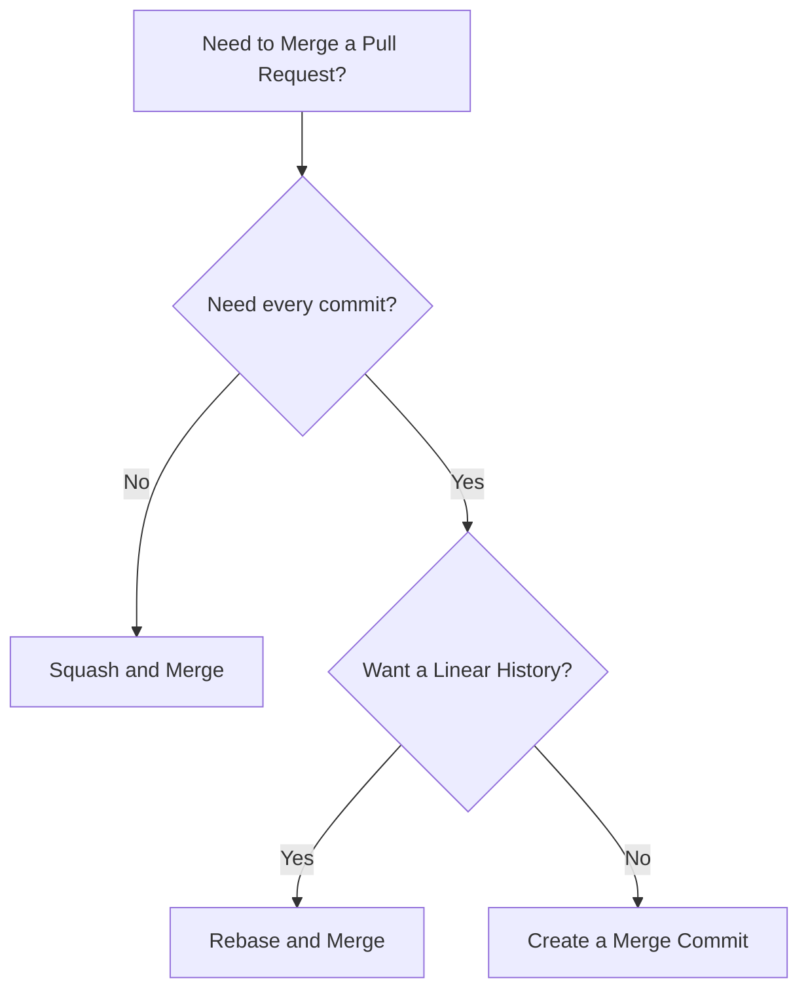

# GitHub Pull Request Merge Strategies

When a Pull Request (PR) is approved, GitHub provides **three ways** to merge the changes into the base branch. Each strategy affects your project's **Git history**, **commit structure**, and **collaboration workflow** differently.

---

# Overview



---

# 1. Create a Merge Commit (Standard Merge)

## What It Does

GitHub keeps **every commit** from the feature branch exactly as they were created and adds a **new merge commit** to connect the feature branch with the base branch.

```text
Feature Branch
A ── B ── C
          \
Main        D ── E
             \
              M  ← Merge Commit
```

After merging:

```text
A ── B ── C
          \
D ─────────M
```

---

## Workflow



---

## Advantages

- Preserves every commit.
- Maintains the original development timeline.
- Keeps complete context of feature development.
- Easy to inspect how the feature evolved.

---

## Best Use Cases

- Large features
- Enterprise projects
- Long-running branches
- Complex debugging
- When every intermediate commit matters

---

## Drawbacks

- Creates extra merge commits.
- Git history becomes cluttered.
- Commit graph can become difficult to follow.

---

# 2. Squash and Merge

## What It Does

GitHub combines (**squashes**) **all commits** in the Pull Request into **one single commit**, then merges that single commit into the base branch.

Instead of:

```text
Feature Branch

A
│
B
│
C
│
D
```

GitHub creates:

```text
Main

A
│
S  ← One Squashed Commit
```

---

## Workflow



---

## Example

Feature branch:

```text
Added Navbar

Fixed CSS

Removed Debug Logs

Updated Footer
```

After Squash:

```text
Feature: Build Responsive Navigation
```

One commit replaces all four commits.

---

## Advantages

- Keeps `main` branch clean.
- One PR equals one commit.
- Easy to read Git history.
- Removes unnecessary WIP commits.
- Preferred by many open-source projects.

---

## Best Use Cases

- Personal projects
- Open-source repositories
- Beginner contributors
- Small features
- Bug fixes
- Documentation updates

---

## Drawbacks

- Original commit history is lost.
- Impossible to see the incremental development steps later.

---

# 3. Rebase and Merge

## What It Does

GitHub moves (**rebases**) each commit from the feature branch onto the latest tip of the base branch **without creating a merge commit**.

Original:

```text
Main

A ── B

Feature

      C ── D
```

After Rebase:

```text
A ── B ── C' ── D'
```

Notice:

- No merge commit
- Commits are preserved
- Commit hashes change (`C → C'`, `D → D'`)

---

## Workflow



---

## Advantages

- Perfectly linear Git history.
- No unnecessary merge commits.
- Keeps individual commits.
- Easier to follow chronological changes.

---

## Best Use Cases

- Teams that require a linear history
- Experienced Git users
- Projects with strict Git workflows
- Developers who want readable history while preserving commits

---

## Drawbacks

- Rewrites commit history.
- Commit hashes change.
- Can complicate collaboration if others are using the same branch.

---

# Decision Guide



---

# Advantages & Disadvantages

| Strategy           | Advantages                                                    | Disadvantages                                          |
| ------------------ | ------------------------------------------------------------- | ------------------------------------------------------ |
| **Merge Commit**   | Full history, preserves all commits, great for large features | Extra merge commits, cluttered history                 |
| **Squash & Merge** | Clean history, one commit per PR, easy to understand          | Loses detailed commit history                          |
| **Rebase & Merge** | Linear history, keeps commits, no merge commits               | Rewrites commit hashes, can complicate shared branches |

---

# Which Strategy Should You Choose?

## Use **Squash and Merge** if:

- You want a clean `main` branch.
- Your PR contains many WIP commits.
- You contribute to open-source projects.
- One PR should become one commit.

> ⭐ **Most commonly used option for open-source repositories.**

---

## Use **Rebase and Merge** if:

- You prefer a perfectly linear Git history.
- Every commit has meaningful information.
- You don't want merge commits.
- Your team follows a rebase-based workflow.

---

## Use **Create a Merge Commit** if:

- You want complete historical context.
- The feature branch has important development history.
- You're working on large or long-running features.
- You want to preserve the exact commit timeline.

---

# Quick

| Goal                                                | Recommended Strategy      |
| --------------------------------------------------- | ------------------------- |
| Clean, readable `main` branch (Most Popular)        | **Squash and Merge**      |
| Perfect chronological history without merge commits | **Rebase and Merge**      |
| Preserve every commit and full development history  | **Create a Merge Commit** |
