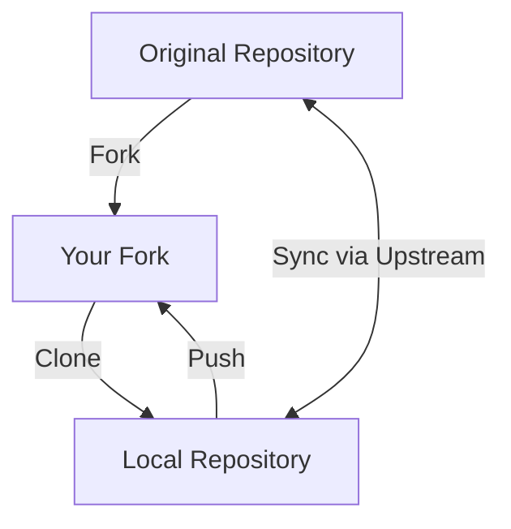
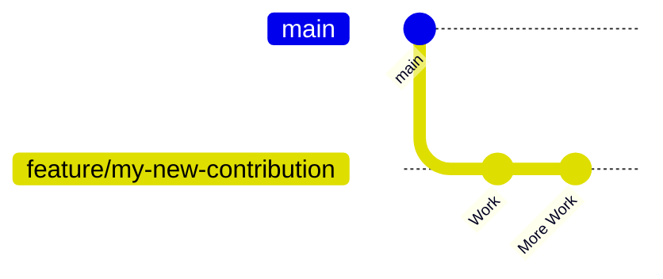
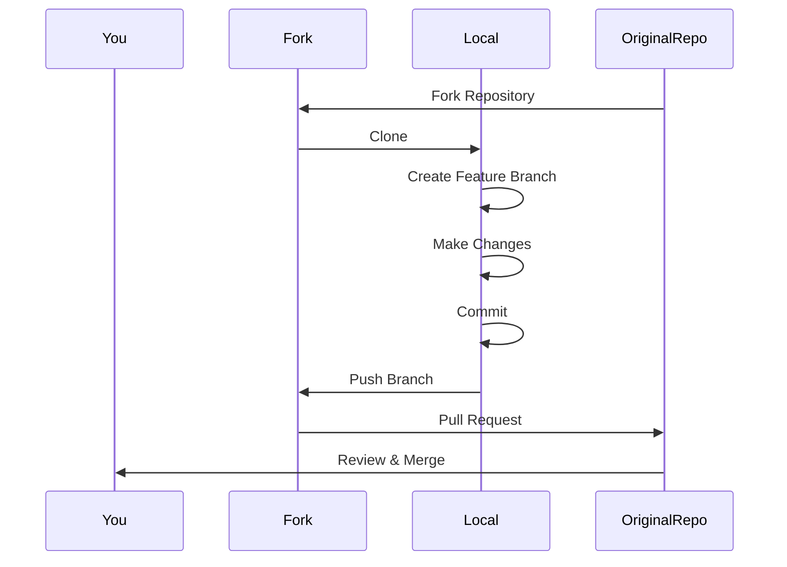

# Contribution

---

# 📌 Contribution Workflow

```mermaid
flowchart LR
    A[Fork Repository] --> B[Clone Your Fork]
    B --> C[Add Upstream Remote]
    C --> D[Create Feature Branch]
    D --> E[Setup Project]
    E --> F[Make Changes]
    F --> G[Commit Changes]
    G --> H[Push Branch]
    H --> I[Create Pull Request]
    I --> J[Code Review & Merge]
```



---

# Step 1 — Fork the Repository

Create your own copy of the repository on GitHub.

Click the **Fork** button in the top-right corner.

Result:

```
Original Repository
        │
        ▼
Your GitHub Fork
```

---

# Step 2 — Clone Your Fork

Download your fork to your local machine.

Replace `YOUR_USERNAME` with your GitHub username.

```bash
git clone https://github.com/YOUR_USERNAME/doby_website.git
cd doby_website
```

Project structure now exists locally.

---

# Step 3 — Add the Upstream Remote

Your fork should stay synchronized with the original repository.

Add the original repository as **upstream**.

```bash
git remote add upstream https://github.com/soorajsrj23/doby_website.git
```

Verify remotes:

```bash
git remote -v
```

Expected output:

```
origin      https://github.com/YOUR_USERNAME/doby_website.git
upstream    https://github.com/soorajsrj23/doby_website.git
```

---

# Repository Relationship



---

# Step 4 — Create a Feature Branch

Never work directly on the `main` branch.

Create a new branch for every feature or bug fix.

```bash
git checkout -b feature/my-new-contribution
```

Examples:

```
feature/login-page

feature/dark-mode

feature/navbar-redesign

bugfix/footer-links

bugfix/mobile-navbar
```

---

# Git Branch Workflow



---

# Step 5— Make Changes

Implement your:

- Feature
- Bug fix
- Documentation improvement
- UI enhancement
- Performance optimization

After verifying everything works correctly:

Stage all files:

```bash
git add .
```

Commit changes:

```bash
git commit -m "Fix: Description of the bug fixed or feature added"
```

Examples:

```bash
git commit -m "Fix: Navbar responsiveness"

git commit -m "Feature: Add FAQ section"

git commit -m "Docs: Update README"
```

---

# Step 7 — Push Your Branch

Upload your branch to your GitHub fork.

```bash
git push origin feature/my-new-contribution
```

Now your branch exists online.

---

# Step 8 — Create a Pull Request

Visit the original repository:

GitHub usually displays a notification:

```
Compare & Pull Request
```

Click it.

Include:

- What changed
- Why it changed
- Screenshots (if UI changes)
- Related issue number (if applicable)

Submit the Pull Request for review.

---

# Complete Contribution Lifecycle



---

# Keeping Your Fork Updated

Before starting a new contribution:

Fetch latest changes:

```bash
git fetch upstream
```

Switch to main:

```bash
git checkout main
```

Merge upstream changes:

```bash
git merge upstream/main
```

Push updated main:

```bash
git push origin main
```

---
